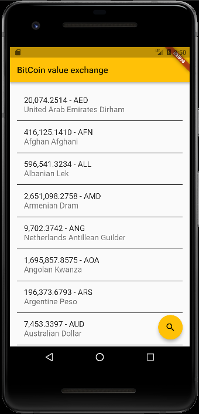

# BitCoin Monitor
> Android bitcoin monitor using Flutter

## What was done

Fetch Bitcoin values from [api](https://www.coindesk.com/api).
Async/await like Javascript and state management like React.

For help getting started with Flutter, view our online
[documentation](https://flutter.io/).

## Meta

Alex Rocha - [about.me](http://about.me/alex.rochas)
